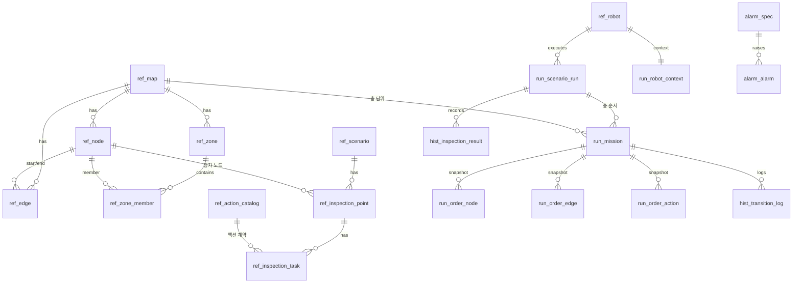

# HD_ACS DB 스키마 카탈로그

> 실행 DDL: `db/schema.sql` (PostgreSQL 15+) │ 설계 근거: `GRAPH_DATA_MODEL.md`
> 네이밍 [C안]: PostgreSQL 스키마(namespace)로 계층 구분 + snake_case
> `ref`(마스터) / `run`(런타임) / `hist`(이력) / `alarm`(알람) / `sys`(시스템) — NAMUGA의 NA_{계층}_ 개념을 스키마로 승계

## 테이블 전체 목록 (30 테이블 + 2 뷰)

| 계층 | 테이블 | 역할 | 근거 |
|---|---|---|---|
| **ref 그래프** | ref.map | 맵 = 화물창 × 층 (mapId='CT1-L1') | 층=맵 모델 |
| | ref.node | 정차/경유 노드 (좌표, 허용편차, ELEVATOR 포함) | VDA 5050 |
| | ref.edge | 주행 간선 (TRAVEL / MANUAL_TRANSFER) | Q9 수동 이송 |
| | ref.zone / ref.zone_member | 층·구역 계층 (FLOOR/AREA/RESTRICTED…) | 4층 슬라이스 |
| **ref 캘리브레이션** | ref.map_calibration | 층별 도면→맵 강체변환 T_W_D (맵버전 바인딩) | PHASE2 WP-1 |
| | ref.map_calibration_point | 기준점 대응쌍 (감사·재계산 보존) | PHASE2 WP-1 |
| **ref 액션** | ref.action_catalog | HD_AMR과 협의된 액션 계약 | Q1 |
| **ref 시나리오** | ref.scenario | 검사 시나리오 (정책 jsonb 외부화) | ADR-010 |
| | ref.inspection_point | 검사 지점 → 노드 참조 (층 자동 결정) | |
| | ref.inspection_task | 검사 작업 참조 (job_ref + position + opaque params) | ADR-001/004 |
| **ref 벽면** | ref.wall | 벽면 레지스트리 + HD_AMR 티칭 키 (tank_id, level, wall_code, description). 정차각 미저장(seam 기하에서 자동 산출) [TANK_WALL_LAYOUT §6.3] | 정차각 자동화 |
| **ref 영역** | ref.inspection_area | 검사 영역 = STATION 1개 = anchorGroup 1개 (면-로컬 **임의 4점 사각형** `corners` jsonb, u/v_min·max=서버 유도 bbox, ref.wall FK). **level = 서버 유도값**(영역 z범위→층 도달 밴드, [SPEC v3.1 §5-A]). `station_standoff_m` = 정차 이격[m](NULL=설정 기본 0.8 — 정차점=중심+내부향 법선 수평성분×이격, [SPEC_AREA §5]). 작업 경계검증=point-in-polygon. 입력 규약은 [TANK_WALL_LAYOUT §6](TANK_WALL_LAYOUT.md) | v3.1 + quad + standoff |
| | ref.area_task | 영역 내 검사 작업 (seam 시작/끝 도면 좌표, 영역 내 순서 seq) | PHASE2 개정 |
| | ref.scenario_area | 시나리오 검사 대상 영역 연결 [부분 검사 계획] — 연결 0건=선창 전체(하위호환), sort_order는 표시용(배차는 greedy) | 부분 검사 |
| | ref.weld_seam | 도면 seam 자동 슬라이싱 원천 (WP-2, **dormant** — 운영 워크플로우 제외) | PHASE2 |
| **ref 로봇** | ref.robot | 로봇 마스터 (manufacturer/serialNumber = MQTT 토픽 요소) | ADR-003 |
| **run 런타임** | run.scenario_run | 시나리오 실행 = 층 미션 시퀀스 (WAITING_FLOOR_TRANSFER) | 8.4절 |
| | run.mission | 층 단위 미션 (order_id = **현재 정차의 orderId**로 정차마다 갱신, 상태머신) | ADR-010 |
| | run.work_item | **실행 큐** — 정차 1곳(영역 1개)의 작업 항목: 정차 맵좌표·검사 액션 jsonb 사전 구성, 상태 PENDING/DISPATCHED/DONE/SKIPPED + attempts(재큐잉), order_id=배차된 orderId. order_action.work_item_id FK로 결과 집계. 상태 머신은 [INSPECTION_SCENARIO §3.1](INSPECTION_SCENARIO.md) | greedy 배차 |
| | run.order_node / order_edge | Order 스냅샷 (sequenceId 짝/홀, released=Base) | ADR-002 |
| | run.order_action | 액션 스냅샷 — actionId가 state 대조 키 | robot-is-truth |
| | run.robot_context | 수동 지정 층 vs 로봇 보고 층 분리 보관 + 최신 상태 캐시 | Q9 검증 게이트 |
| **hist 이력** | hist.transition_log | 상태머신 전이 이벤트 | ADR-010 |
| | hist.inspection_result | 검사 수행 이력 — 위치+시각 대조 키 보존 | ADR-004, Q2 |
| **alarm** | alarm.spec / alarm.alarm | 알람 정의/발생(cleared_at NULL=활성) | NAMUGA 승계 |
| **sys** | sys.app_user | 계정/권한 (ADMIN/OPERATOR/VIEWER, user는 PG 예약어라 app_user) | NAMUGA 승계 |
| | sys.audit_log | 수동 존 변경·비상정지 등 감사 기록 | Q9 |
| **뷰** | run.mission_progress_vw | 미션 진행률 집계 (UI/SignalR) | *_VW 패턴 |
| | ref.node_vw | 노드+층+존 평탄화 (전개도/3D 조회) | |

## ERD

## 핵심 설계 규칙 요약
1. **③시나리오는 ①그래프를 참조, ④런타임은 스냅샷** — 맵/시나리오 수정에도 미션 이력 불변
2. **한 미션 = 한 층(map)** — MANUAL_TRANSFER 엣지는 경로계산·Order 제외, RUN이 층 시퀀스 관리
3. **actionId·sequenceId를 ACS가 발급·보존** — VDA 5050 state와의 대조 키 (재접속 동기화의 기반)
4. **수동값/보고값 분리** — run.robot_context의 manual_map_id vs reported_map_id, 릴리즈 가드
5. **위치+시각 대조 키 보존** — hist.inspection_result.position/occurred_at = 검사 S/W 연계 키 [Q2]
6. EF Core code-first + 마이그레이션 채택, `ToTable("ref.node")`로 네이밍 유지, 폐쇄망 배포 시 SQL export
