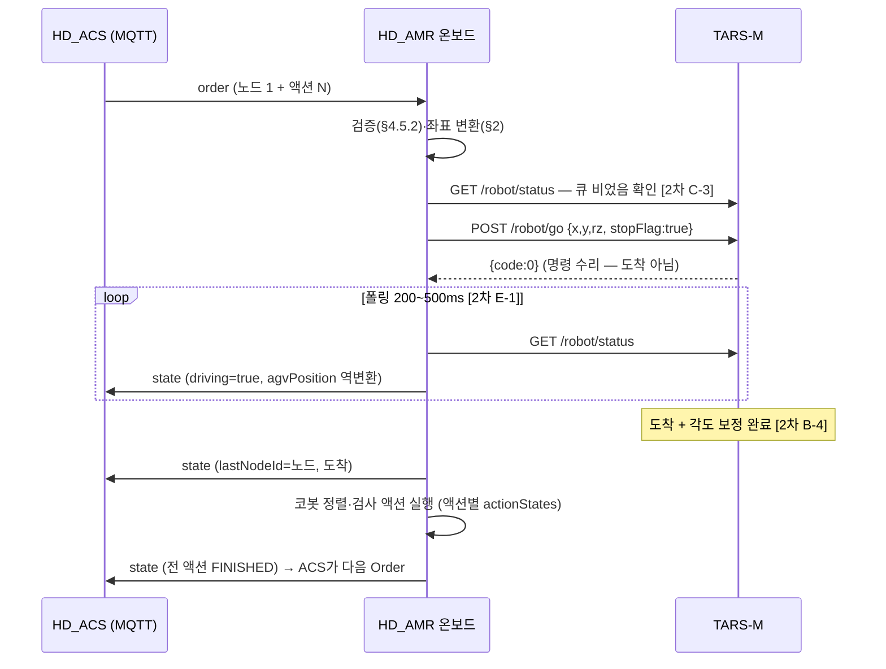

# HD_AMR ↔ TARS-M 연동 사양서 (VDA 5050 의무의 온보드 구현)

| 항목 | 내용 |
|---|---|
| 문서 버전 | 0.9 (draft — 2차 질의 A~E 회신 시 1.0 확정) |
| 작성일 | 2026-09-01 |
| 대상 | HD_AMR 통합 운영 S/W 개발팀 |
| 상위 계약 | `VDA5050_INTERFACE_SPEC.md` — HD_ACS ↔ HD_AMR (확정, N10만 보류) |
| 하위 참조 | `ADENT_TARSM_V3_OPENAPI.yaml` — TARS-M v3 REST 재구성 초안 / Modbus TCP 레지스터 맵 매뉴얼 |
| 미확정 근거 | `ADENT_VENDOR_INQUIRY_2.md` — 2차 질의 A~E (본문에 `[2차 X-n]`으로 참조) |

> **이 문서의 지위**: 상위 계약(VDA 5050)이 HD_AMR에 부과하는 의무를 TARS-M(아덴트로봇)의
> REST·Modbus 프리미티브로 **어떻게 구현하는가**를 규정하는 브릿지 사양이다.
> 상위 계약과 충돌하면 상위 계약이 우선하고, TARS-M 사실관계와 충돌하면 벤더 회신이 우선한다.
> `[2차 X-n]` 표시가 붙은 규정은 해당 회신 전까지 **잠정**이다.

---

## 1. 아키텍처와 책임 경계

```
HD_ACS (관제) ──── VDA 5050 over MQTT ────▶ HD_AMR 통합 운영 S/W (온보드)
                                              │            │           │
                                     TARS-M REST(:80)   Modbus TCP   (코봇·검사장비
                                     /go /status /state  PoseSearch 등  제어 — 본 문서 범위 외)
                                              ▼            ▼
                                          TARS-M AMR 플랫폼 (아덴트로봇)
```

| 계층 | 책임 |
|---|---|
| HD_ACS | 계획·배차(Order)·기록 — TARS-M을 직접 호출하지 않음 |
| **HD_AMR (본 문서)** | VDA 수신·검증, **좌표 변환(층별↔통합맵)**, TARS-M 주행 지시·완료 판정, 상태 합성·VDA state 발행, 에러 매핑, 재측위 게이트, 코봇/검사 시퀀스 구동 |
| TARS-M | SLAM 측위·경로 계획·장애물 회피·주행 실행 |

**확정된 TARS-M 전역 규약** (1차 회신): 인증 없음·80포트 / 응답 envelope `{code:0,data}` | `{code≠0,message}` /
`/go`는 **비동기·큐 추가(append)** / 좌표 = SLAM 맵 원점(**좌측 하단**) 기준, `rz` = 맵 X축 CCW 라디안.

---

## 2. 좌표 변환 사슬 (HD_AMR 핵심 책임)

VDA 계약은 **층별 mapId + 층별 좌표**(`CT1-L{n}`, 층 맵 원점 기준)이고, TARS-M은 층 4장을 타일 배치한
**통합맵 좌표** 하나로 동작한다. 변환은 HD_AMR이 수행하며 ACS에 투명하다(VDA 사양서 §10 고지 확정).

```
VDA nodePosition(mapId=CT1-L2, x, y, theta)
  → 통합맵 좌표 = (x + Tile[L2].dx,  y + Tile[L2].dy),  rz = theta      … 타일 배치가 평행이동일 때
  → TARS-M /go { x, y, rz, stopFlag: true }
역방향: TARS-M 측위(통합맵) − 현재 층 타일 오프셋 → VDA agvPosition(층별 좌표 + mapId)
```

- **타일 오프셋 테이블 `Tile[L1..L4] = (dx, dy)`**: HD_AMR 설정으로 관리(통합맵 제작 시 확정). 타일 배치에
  회전이 들어가면 회전항 포함 — **배치 시 회전 없이 평행이동만 사용할 것을 권장**(변환·각도 처리 단순화).
- 두 좌표계 모두 m·CCW rad·좌하단 원점 관례로 동일 — 단위/부호 변환 없음.
- **"현재 층"의 판정**은 §6 재측위 게이트의 결과이며, 측위 좌표가 어느 타일 영역에 있는지로 추정하지 말 것
  (유사 형상 오수렴 시 잘못된 층을 자기강화함 `[2차 A-4]`).

---

## 3. VDA 의무 → TARS-M 구현 매핑 (총괄표)

| VDA 의무 (사양서 절) | TARS-M 구현 경로 | 미확정 |
|---|---|---|
| Order 수신→주행 (§4) | 큐 비움 보장 → `/go(stopFlag=true)` → `/status` 폴링 | C-1~3, B-2 |
| 도착 판정 (§4.2 allowedDev) | `status.schedule` 도착 + **각도 보정 완료** 시점 | B-4, B-5 |
| 신규 orderId=이전 폐기 (§4.5.1) | `/state` 정지·큐 정리 → 빈 큐 확인 → 새 `/go` | C-1, C-3 |
| state 2초+이벤트 발행 (§6) | `/status` 200~500ms 폴링 합성 (+Modbus 보조) | B-2, E-1, E-2 |
| errors 7종 보고 (§6.4) | TARS-M 에러코드 → 4분류 매핑 테이블 (§5) | **B-1(차단)** |
| emergencyStop (§5.1) | `/state` 정지 + 코봇 정지(별도 경로) | C-4 |
| initPosition·층 전환 (§5.2, §9.2) | Modbus PoseSearch + 일치율 검증 게이트 (§6) | **A-1~5(차단)** |
| 두절 자율 계속 (§9.3) | MQTT는 HD_AMR↔브로커 구간 — TARS-M 무관, 로컬 큐로 계속 | — |
| 액션 없는 Order (§4.1) | 주행만 수행, 도착 즉시 완결 보고 | — |

---

## 4. Order 실행 절차 (정상 경로)



**규정**:

1. **stopFlag는 항상 true** — 검사 정차는 각도 보정(rz) 필수(노드 theta=벽 정면 전제, VDA §4.4·§5.2 방향 유도).
   `false`(경유점)는 현 계약에 개념이 없으므로 사용하지 않는다.
2. **`/go` 성공 응답은 "수리"일 뿐** — 도착·실패 판정은 반드시 `/status` 폴링으로 한다(1차 2.2 확정).
3. **발행 전 큐 비움 보장**: `/go`는 대체가 아니라 **추가**이므로, 새 목적지 발행 전 큐가 비어 있음을
   확인한다. 정상 흐름(도착 완결 후 다음 Order)에서는 자연 충족되나, §4.1의 폐기 경로에서는 필수.
4. **도착 판정 = 각도 보정 완료 시점** `[2차 B-4 확인 중]` — 정차 직후 코봇이 동작하므로 위치 도달만으로
   판정하지 말 것. VDA lastNodeId 보고도 이 시점.
5. 도착 오차는 allowedDeviation(0.08m/0.07rad, 미지정 0.1/0.1)을 **도착 판정 허용치로만** 사용(확정) —
   실측 정차 오차 `[2차 B-5]` 회신 시 값 재검토.

### 4.1 신규 orderId 수신 = 이전 Order 폐기 (VDA §4.5.1)

```
신규 orderId 수신
  → POST /robot/state (주행 정지)  [2차 C-1: 정지 vs 큐삭제 구분 확인 중]
  → 감속 완료·큐 비었음 확인       [2차 C-1/C-3]
  → 진행 중이던 코봇 동작 중단·이전 Order actionStates 정리
  → 새 Order를 §4 절차로 실행
```

⚠ `/state` 정지 후 큐에 이전 목적지가 남는 사양이라면 **명시적 큐 삭제 절차가 추가로 필요** — C-1 회신에
따라 본 절을 확정한다. 큐 잔존 상태에서 `/go`를 발행하면 로봇이 이전 목적지를 경유하며 **검사 위치만
틀리는 조용한 실패**가 된다(1차 2.6 확정 사실 — 본 연동의 최우선 금지 사항).

### 4.2 주행 실패 (VDA §6.4 drivingFailed)

`/go` 실패 응답(`code≠0`) 또는 `/status.error`의 주행 실패 코드 → **해당 Order의 전 액션을 FAILED로
종결**(노드 미도달 상태) + VDA `errors[]`에 `drivingFailed` 보고. ACS는 이 조합을 정차 종결로 판정하고
재시도 정책을 태운다(ACS 측 구현 완료, 2026-08-28). 진입 강행 금지.

---

## 5. 상태 합성 — VDA state 필드별 소스

| VDA state 필드 | 소스 | 비고 |
|---|---|---|
| agvPosition (x,y,theta) | TARS-M 측위(통합맵) → §2 역변환 | 위치 필드의 REST 경로 미확정 `[2차 B-2]` — Modbus 위치 레지스터 병용 가능 |
| agvPosition.mapId | **§6 재측위 게이트의 확정 층** | 좌표로 추정 금지 |
| driving | `status.schedule` (이동 중 여부) | 값 목록 `[2차 B-2]` |
| lastNodeId/SequenceId | §4 도착 판정 시점에 갱신 | |
| actionStates | 코봇/검사 시퀀스 진행 (본 문서 범위 외 장비 경로) | |
| batteryState | TARS-M 상태 (REST 필드 미확정 — Modbus 배터리 레지스터 병용) | `[2차 B-2]` |
| errors | §5.1 매핑 테이블 | `[2차 B-1]` |
| operatingMode 등 표준 필드 | 고정값/기능값 (VDA §6.3 확정 — ACS 미소비) | |

발행 주기: **2초 정기 + 이벤트(도착·actionStatus 변화·오류·Order 수신) 즉시** (ACS 확인 완료).
`/status` 폴링 주기는 200~500ms 검토 `[2차 E-1]` — rate limit 회신 시 확정.
REST `schedule`과 Modbus WorkStatus(Input 64) 중 **정본 지정** `[2차 E-2]` 회신 대기 — 회신 전까지 REST를 정본으로 가정.

### 5.1 에러코드 → VDA errorType 매핑 (골격 — B-1 회신으로 채움)

| TARS-M 소스 | VDA errorType | 후속 동작 |
|---|---|---|
| `/go`·`/status` 주행 실패 코드군 | `drivingFailed` | §4.2 — 전 액션 FAILED 종결 |
| PoseSearch 실패·일치율 임계 미달 | `localizationLost` | §6 — 기존 mapId 유지·positionInitialized=false |
| 장비(모터·센서·통신) 이상 코드군 | `equipmentError` | WARNING, 지속 불가 시 FATAL |
| 소프트 정지 중 (§7) | `emergencyStopActive` | 진행 액션 FAILED("stopped by emergencyStop") |

규칙(VDA §6.4 확정): 같은 errorType은 최신 1건만 유지, 해소 시 제거. `error` 필드의 자동 해소 여부
`[2차 B-2]`에 따라 해소 검출 로직을 정한다.

---

## 6. 층 전환·재측위 게이트 (최우선 미확정 — 2차 A장)

VDA §9.2의 층 검증 게이트("재측위 검증 통과 시에만 새 mapId 보고" — ACS에 고지 확정)를 TARS-M으로 구현:

```
엘리베이터 수동 이송 → 운영자 층 선택 / ACS initPosition(멱등)
  → 대상 층 타일의 초기 추정 좌표로 PoseSearch (Modbus Holding 20~26)  [REST 경로 유무 2차 A-5]
  → 완료/실패 판정                                                        [2차 A-2]
  → 맵 일치율(Input 30) ≥ 임계값 검증                                     [2차 A-3: 임계 권고치]
  → (오수렴 방지: 국소 탐색 반경 확인·초기 좌표 강제)                       [2차 A-1/A-4]
  → 전부 통과 시에만: 현재 층 = 대상 층 확정 → VDA mapId 갱신 보고
  → 실패 시: 기존 mapId 유지 + positionInitialized=false + localizationLost
```

⚠ **A-4(유사 형상 4타일 오수렴)는 본 연동의 안전 요건** — 층을 오인하면 로봇은 정상 동작하면서 검사
위치만 틀린다. 회신 전 잠정 방어: ① PoseSearch 초기 좌표를 반드시 대상 층 타일 내부로 지정 ② 탐색이
전역이라면 결과 좌표가 대상 타일 영역 밖일 때 실패로 처리 ③ 일치율 외 교차 검증 지표 확보 시 병용.

---

## 7. 기능 정지 (VDA §5.1 emergencyStop)

`emergencyStop` 수신 → ① `POST /robot/state` 주행 정지 `[2차 C-4: 소프트 정지 확인 중]` ② 코봇 즉시
정지(장비 경로) ③ 진행 액션 FAILED + `emergencyStopActive` 보고. **하드웨어 안전 회로와 별개의 기능
정지**이며(ADR-007), 정지 중 `/go` 발행 시 동작(거부? 큐 적재?) `[2차 C-4]` 회신 전에는 정지 중 신규
`/go`를 발행하지 않는다(ACS도 정지 시 run 자동 중단으로 재배차를 차단함 — 이중 방어).

---

## 8. 두절·재접속 (VDA §9.3)

- MQTT LWT/재접속은 HD_AMR↔브로커 구간의 책임 — TARS-M과 무관.
- 두절 중 HD_AMR은 수신 완료된 Order를 로컬로 계속 실행(TARS-M 제어는 로봇 내부망이라 영향 없음),
  결과를 로컬 보존 후 재접속 시 최신 state 즉시 발행.
- Wi-Fi 로밍 중 Modbus/REST 세션 특성 `[2차 E-3]` — 온보드 재접속 정책(타임아웃·재시도)에 반영.

---

## 9. 미확정 의존성 매트릭스 (2차 질의 ↔ 본 사양)

| 2차 항목 | 차단되는 절 | 회신 전 잠정 조치 |
|---|---|---|
| **A-1~5 재측위** | §6 전체 — **층 전환 기능 구현 불가** | 단층(실험실) 평가 선행, 층 전환은 회신 후 |
| **B-1 에러코드** | §5.1 매핑 — 실패 정책 분기 불가 | 모든 `code≠0`을 drivingFailed로 잠정 일괄 처리 |
| B-2 status 스키마 | §4 도착 판정·§5 상태 합성 | 실 로봇 Swagger 화면·실측정으로 선확인 |
| B-4/B-5 도착 판정·정밀도 | §4 규정 4·5 | 보정 완료 가정, allowedDev 0.08/0.07 잠정 |
| C-1~3 정지·큐 | §4.1 폐기 경로 | 교체 시나리오(비상정지 후 재배차) 실기 주의 |
| C-4 정지 관계 | §7 | 정지 중 신규 `/go` 발행 금지 |
| D-1~4 통합맵 운용 | §2 타일 테이블·맵 버전 연동 | 통합맵 제작 시 벤더 입회 확인 |
| E-1~5 운영 파라미터 | §5 폴링·정본 지정 | REST 정본·250ms 폴링 잠정 |

## 10. 잠정 파라미터 (회신·실측으로 확정)

| 파라미터 | 잠정값 | 근거 |
|---|---|---|
| `/status` 폴링 주기 | 250 ms | VDA 2초 발행+이벤트 즉시에 충분 `[E-1]` |
| 도착 판정 허용 | 0.08 m / 0.07 rad | VDA §4.2 (AMR 미지정 시 0.1/0.1) `[B-5]` |
| 맵 일치율 임계 | TBD | `[A-3]` — 실험실 실측으로 초기값 도출 가능 |
| `/go` 수리 실패 재시도 | 1회 후 drivingFailed | `[B-3]` |
| 타일 오프셋 Tile[L1..L4] | 통합맵 제작 시 확정 | §2 |
