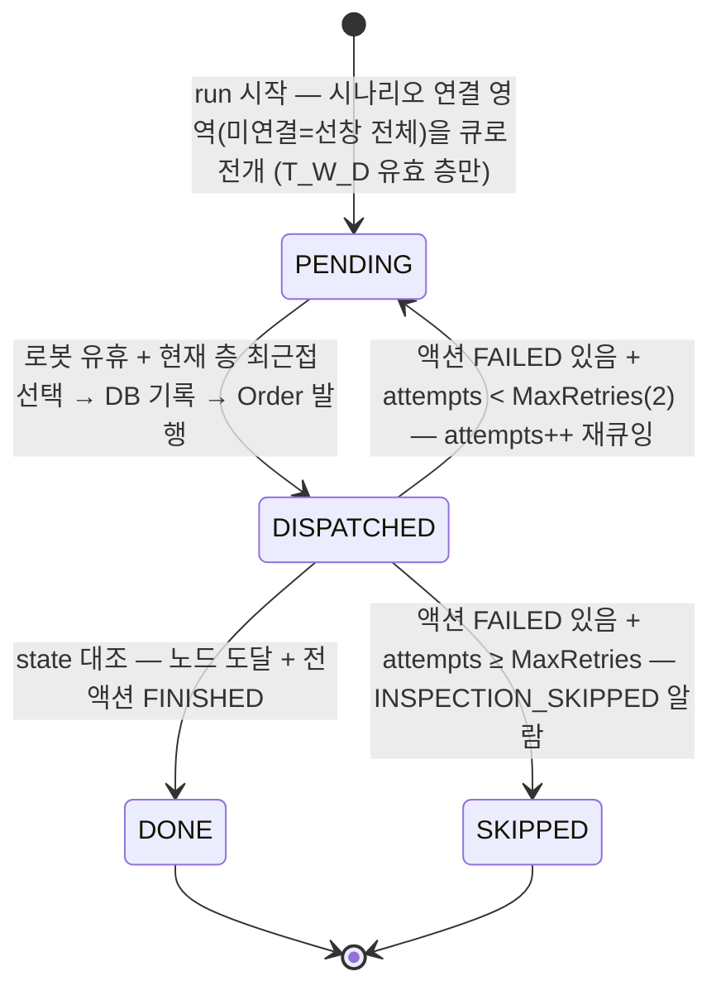

# 검사 시나리오 모델

> 원칙: HD_ACS의 시나리오는 "어느 지점에서 어떤 검사 작업을 어떤 순서로" 수준까지만 정의한다.
> 검사 작업의 실행 방법(협동로봇 자세 시퀀스, 장비 세부 제어)은 HD_AMR에 정의되어 있으며 ACS는 알지 못한다 [ADR-001].
> 데이터 스키마는 VDA 5050 액션 카탈로그(Q1) 확정 후 구체화한다.
> 미션은 층(map) 단위로 분할된다 — 여러 층에 걸친 시나리오는 층별 미션 시퀀스로 분해되고, 층 전환은 작업자 수동 절차이다.

## 1. 개념 계층

```
Scenario (검사 시나리오)
 └── InspectionPoint[] (검사 지점, 순서 있음)
      ├── amr_goal          : AMR 목표 위치 — VDA 5050 Order의 노드로 변환
      └── InspectionTask[]  : 지점 내 검사 작업 — VDA 5050 커스텀 액션으로 변환
           ├── job_ref      : HD_AMR에 정의된 검사 작업 식별자 (실행 내용은 HD_AMR 소관)
           ├── position     : 촬영 명령에 전달하는 위치 정보 [ADR-004]
           └── params       : HD_AMR이 해석하는 불투명(opaque) 파라미터 — ACS는 저장·전달만
```

- **Scenario**: 운영자가 실행하는 단위. 이름, 버전, 대상(화물창/구역), 지점 목록, 운영 정책 포함
- **InspectionPoint**: AMR이 정차하는 하나의 위치. 한 지점에서 여러 검사 작업 수행 가능
- **InspectionTask**: HD_AMR의 검사 작업을 참조하는 최소 지시 단위 — 웨이포인트·장비 파라미터 같은 실행 세부는 포함하지 않는다

## 2. 실행 계층 — run > mission > work_item > order_action [2026-08-10 greedy 큐 모델]

시나리오 실행(run) 시 계획(영역·검사 작업)이 **실행 큐(`run.work_item`)로 일괄 전개**되고
— 전개 범위는 **시나리오에 연결된 검사 대상 영역**(`ref.scenario_area`, [부분 검사 계획 2026-08-28])이며
**연결 0건이면 선창 전체**(하위호환·정기 전수검사). 전개는 run 시작 시점 스냅샷이라 이후 시나리오 변경은 진행 중 run에 무영향 —
Order는 일괄 생성이 아니라 **큐에서 항목을 꺼낼 때마다 생성·발행**된다(정차 단위 단일 노드 Order, greedy 최근접).
ACS는 큐 입력 시점부터 항목별 작업 상태를 DB로 관리한다 — VDA 5050이 다루는 것은 "발행 이후"뿐이며,
발행 전 수명(큐·선택·재시도 판단)은 전부 ACS 자체 상태 관리다.

| 계층 | 단위 | 상태 컬럼 | 역할 |
|---|---|---|---|
| `run.scenario_run` | 시나리오 실행 1회 | RUNNING / WAITING_FLOOR_TRANSFER / COMPLETED / ABORTED | 층 진행·완료의 최상위 |
| `run.mission` | **층 1개** | Created / Released / Running / Disconnected / Paused / Completed / Aborted (Stateless [ADR-010]) | 층 게이트·연결 상태. `order_id` = **현재 정차의 orderId**(정차마다 갱신 — state 대조 키) |
| `run.work_item` | **정차 1곳**(영역 1개) | PENDING / DISPATCHED / DONE / SKIPPED (+`attempts`) | 실행 큐 — 정차 맵좌표·검사 액션 jsonb 사전 구성 |
| `run.order_action` | 검사 액션 1건 | WAITING / RUNNING / FINISHED / FAILED | actionId(ACS 발급)로 state.actionStates와 대조 |

## 3. 상태 정의

상태의 진실은 HD_AMR의 VDA 5050 `state` 보고이며, ACS 상태머신은 이를 트리거로 전이한다 (robot-is-truth).
단, **발행 전 상태(PENDING·greedy 선택·재큐잉 판단)는 ACS가 단독 결정**한다.

### 3.1 실행 큐(work_item) 상태 머신 — 발행 전후를 잇는 핵심



| 전이 | 트리거(코드 기준) |
|---|---|
| →PENDING (전개) | `InspectionDispatcher.BuildQueueAsync` — 영역→정차 맵좌표(standoff)+액션 payload 사전 구성, 발행 전 param_schema 검증(위반 시 run 시작 거부) |
| PENDING→DISPATCHED | `DispatchNextAsync` greedy 최근접 1건 → `PublishStopAsync`(저장 후 발행, work_item.order_id·mission.order_id 갱신) |
| DISPATCHED→DONE/PENDING/SKIPPED | `RobotStateService` 정차 완료 판정(잔여 액션 0 + lastNodeSequenceId 도달) → `HandleStopOutcomeAsync` 실패 집계 |
| 재큐잉 재발행 | **신규 orderId의 새 Order** (order update 아님 — VDA5050_INTERFACE_SPEC §4.5) |

재시도 상한: `Acs:Dispatch:MaxRetries`(기본 2). 층의 PENDING 소진 시 → 그 층 미션 Completed →
다른 층 남으면 run WAITING_FLOOR_TRANSFER, 전부 소진이면 run COMPLETED (SKIPPED 포함 완료).

**중단(abort)·재개(resume) 규정** [2026-08-28]:
- `POST /api/runs/{id}/abort` — run ABORTED·후속 배차 중지. **진행 중 Order는 회수하지 않음**(cancelOrder 미사용,
  로봇은 현재 정차를 완주하고 그 결과는 DONE/FAILED로 기록됨 — 디스패처가 ABORTED/COMPLETED run에는 배차·완료 전이를 하지 않아
  중단 상태가 유지된다). 즉시 정지는 비상정지 사용.
- `POST /api/runs/{id}/resume` — **DONE/SKIPPED 보존(재검사 없음)**, 중단 시점에 종결 못 한 DISPATCHED는
  PENDING으로 리셋(attempts 유지)해 재검사, 잔여 PENDING만 greedy 재배차. COMPLETED run은 재개 불가(400).
- 동일 로봇에 활성(RUNNING/WAITING_FLOOR_TRANSFER) run이 있으면 새 시작·타 run 재개 거부(409).
- **새 run 시작 = 여전히 선창 전체 전개**(정기검사 사이클) — 완료 이력은 run 스코프이며 run 간 이월되지 않는다.
  이력의 영구 기록은 `hist.inspection_result`(리포트/추적용).

### 3.2 미션(층) 수준 (Stateless 상태머신 [ADR-010])
| 상태 | 설명 |
|---|---|
| Created | 층 미션 생성 (run 시작 시 층별 1개) |
| Released | 현재 정차 Order 발행됨 |
| Running | HD_AMR 실행 중 (state 보고 수신) |
| Disconnected | 통신 두절 — HD_AMR은 온보드 실행 지속, ACS는 마지막 상태 유지 표시 |
| Paused | 운영자 일시정지 (instantAction) |
| Completed | 그 층 work_item 전부 종결 (DONE/SKIPPED) |
| Aborted | 정책 또는 운영자에 의해 중단 |

층 전환 대기(WAITING_FLOOR_TRANSFER)는 미션이 아니라 **run 수준** 상태다 — 작업자 수동 이송 +
존 변경(initPosition) + mapId 검증 게이트 후 다음 층 미션의 배차 재개 (GRAPH_DATA_MODEL.md 8.4).

### 3.3 검사 액션 수준 (state.actionStates 대조 — actionId는 ACS 발급 키)
| 상태 | 설명 |
|---|---|
| WAITING | Order에 실려 발행됨, 미시작 |
| RUNNING | HD_AMR 실행 중 |
| FINISHED | 성공 — hist.inspection_result SUCCESS 기록 |
| FAILED | 실패 — 결과 기록 + work_item 실패 집계(§3.1 재큐잉/스킵) |

## 4. 실패 처리 정책 (시나리오 데이터로 외부화 [ADR-010])

ACS는 HD_AMR이 보고하는 실패(errors, actionStatus=FAILED)의 유형 코드를 기준으로 정책을 적용한다.
실패의 원인 세부(자세 실패인지, 장비 오류인지)는 HD_AMR의 error 분류를 따른다.

| HD_AMR 보고 실패 유형 | 기본 정책 (초안) |
|---|---|
| 이동 실패 (경로 불가/장애물) | 재시도 2회 → 지점 스킵 + 알람 |
| 이동 타임아웃 | 재시도 1회 → 스킵 + 알람 |
| 검사 작업 실패 (액션 FAILED) | 해당 액션 재시도 1회 → 액션 스킵 기록 |
| 촬영 실패 응답 [ADR-004] | 재시도 2회 → 실패 기록 + 알람 |
| 배터리 저전압 | 미션 일시정지 → 복귀 정책 (TBD) |
| 로봇 측 비상 이벤트 | 미션 중단, 운영자 개입 필수 |

정책 파라미터(재시도 횟수, 스킵 조건)는 시나리오 데이터에 저장되어 코드 수정 없이 조정 가능하다.

## 5. 시나리오 예시 (개념)

```yaml
scenario:
  name: "1번화물창_횡방향용접부_정기검사"
  version: 3
  policy: { move_retry: 2, task_retry: 1, on_point_fail: skip_and_alarm }
  points:
    - id: P01
      amr_goal: { node_id: "N_P01", x: 12.4, y: 3.1, theta: 1.571 }   # → Order 노드 (theta는 rad, 맵 X축 CCW)
      tasks:
        - id: T01
          job_ref: "WELD_SEAM_SCAN_A"        # HD_AMR에 정의된 검사 작업 — 내용은 ACS 관여 밖
          position: { x: 12.4, y: 3.1, z: 0.0 }   # 촬영 명령 위치 파라미터 [ADR-004]
          params: { profile: "default" }      # opaque — HD_AMR이 해석
    - id: P02
      ...
```
