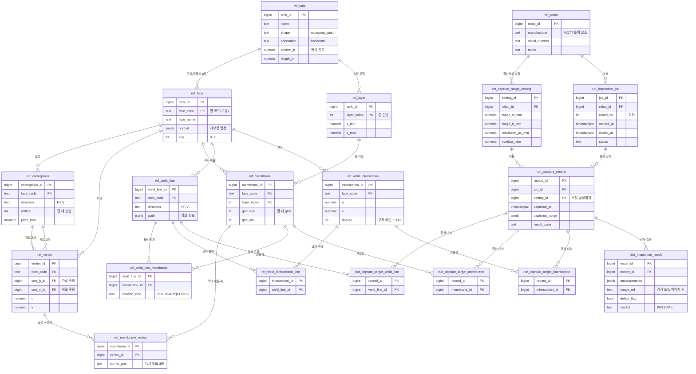

# 멤브레인·용접 검사 도메인 모델 (Membrane & Weld Inspection Domain)

> 상태: 설계 초안(제안) │ 대상: LNG 화물창 멤브레인 표면·용접부 형상과 로봇 촬상/검사 실적
> 네이밍 규약: PostgreSQL 스키마 네임스페이스(`ref`/`run`/`hist`) + snake_case — [DB_SCHEMA.md](DB_SCHEMA.md) 승계
> 관련 문서: [TANK_WALL_LAYOUT.md](TANK_WALL_LAYOUT.md)(면 naming·면-로컬 (u,v) 규약), [TANK_RENDERING.md](TANK_RENDERING.md)(좌표 3단), [GRAPH_DATA_MODEL.md](GRAPH_DATA_MODEL.md)(자료구조)

---

## 1. 목적과 범위

본 문서는 **화물창 표면 형상(멤브레인/주름/꼭짓점)** 과 **용접부(용접라인/교차점)**, 그리고 **로봇의 촬상·검사 실적** 을 관계형으로 표현하는 도메인 모델을 정의한다.

- **포함**: 형상 정적 마스터(선창·면·층·주름·꼭짓점·멤브레인·용접라인·용접교차점), 로봇/촬상 설정, 검사 세션·촬상 실적·검사 결과
- **제외**: 로봇 저수준 제어(자세·시퀀스)는 HD_AMR 책임(VDA 5050 단일 인터페이스). 본 모델은 **형상/실적 데이터 모델링** 계층이며, 실제 배차·주행 모델(`ref.map`/`run.mission` 등)과는 별개 계층으로 둔다.
- **경계**: 이미지 바이너리·측정 원본은 별도 검사 S/W 소관(`ADR-004`, Q2). 본 모델은 참조 키(`image_ref`)만 보존한다.

---

## 2. 도메인 설명

### 2.1 형상 구조

- **선창(Tank)**: 팔각기둥 형상이며 수평으로 눕혀져 있다. 내부는 층(Layer)으로 나뉜다.
- **면(Face)**: 선창은 **8개의 면**을 가지며, 각 면에는 고유 명칭이 부여된다.
- **층(Layer)**: 선창 내부를 수평 방향으로 나눈 구획. 멤브레인의 위치 식별에 사용된다.
- **Corrugation(주름)**: 각 면에 존재하는 주름(융기) 구조. 방향성(가로/세로)을 가진다.
- **꼭짓점(Vertex)**: Corrugation이 서로 만나 생기는 교차점.
- **멤브레인(Membrane)**: 인접한 Vertex 4개로 둘러싸인 사각 구획. **로봇이 측정하는 최소 단위**. 위치는 **(Face, Layer, 면 내 grid 좌표 row/col)** 로 유일하게 식별된다.

### 2.2 용접 구조

- **용접라인(WeldLine)**: 각 면에 존재하는 용접 경로. 방향성(가로/세로)을 가진다. 멤브레인 경계를 공유하며 멤브레인을 횡단할 수 있다 → 멤브레인과 **N:M** 관계.
- **용접교차점(WeldIntersection)**: 용접라인끼리 교차하는 지점. 별도 엔티티로 저장한다. 각 교차점은 교차하는 **2개 이상**의 WeldLine과 연결되며, 위치 좌표를 가진다.

### 2.3 로봇·촬상·검사

- **로봇(Robot)**: 모든 용접라인을 촬상한다. 여러 대일 수 있다.
- **촬상범위 설정(CaptureRangeSetting)**: 로봇이 한 작업에서 촬상 가능한 범위를 정의하는 설정값(범위 폭/높이, 해상도, 오버랩 등). Robot 1:N.
- **검사작업(InspectionJob)**: 언제·어느 로봇이·몇 회차에 수행했는지를 묶는 검사 세션.
- **촬상 실적(CaptureRecord)**: 로봇이 실제로 촬상한 범위·대상을 기록하는 실행 로그. InspectionJob에 소속되며, 촬상 대상(WeldLine·Membrane·WeldIntersection)과 연결된다.
- **검사 결과(InspectionResult)**: 촬상 실적에 대한 측정값·이미지 참조·결함/판정 결과를 저장한다.

---

## 3. 엔티티 요약

| 계층 | 엔티티(테이블) | 역할 | 유형 |
|---|---|---|---|
| **ref 형상** | `ref.tank` | 선창 마스터(팔각 파라미터) | 마스터 |
| | `ref.face` | 면 8개(고유 코드) | 마스터 |
| | `ref.layer` | 수평 층 구획 | 마스터 |
| | `ref.corrugation` | 면 내 주름(가로/세로) | 마스터 |
| | `ref.vertex` | 주름 교차 꼭짓점 | 마스터 |
| | `ref.membrane` | 4꼭짓점 사각 구획(측정 최소 단위) | 마스터 |
| | `ref.membrane_vertex` | 멤브레인↔꼭짓점(코너 4) | **매핑** |
| | `ref.weld_line` | 면 내 용접 경로 | 마스터 |
| | `ref.weld_line_membrane` | 용접라인↔멤브레인(경계/횡단) | **매핑** |
| | `ref.weld_intersection` | 용접라인 교차점 | 마스터 |
| | `ref.weld_intersection_line` | 교차점↔용접라인(≥2) | **매핑** |
| **ref 로봇** | `ref.robot` | 로봇 마스터 | 마스터 |
| | `ref.capture_range_setting` | 촬상범위 설정 | 마스터 |
| **run 실행** | `run.inspection_job` | 검사 세션(로봇·회차·시각) | 런타임 |
| | `run.capture_record` | 촬상 실적(실행 로그) | 런타임 |
| | `run.capture_target_weld_line` | 실적↔용접라인 | **매핑** |
| | `run.capture_target_membrane` | 실적↔멤브레인 | **매핑** |
| | `run.capture_target_intersection` | 실적↔용접교차점 | **매핑** |
| **hist 결과** | `hist.inspection_result` | 검사 결과(측정·이미지·판정) | 이력 |

> N:M 관계는 모두 매핑(연결) 엔티티로 명시적으로 분해했다.

---

## 4. ERD

---

## 5. 관계·카디널리티 정리

| 관계 | 카디널리티 | 라벨 | 비고 |
|---|---|---|---|
| Tank–Face | 1:N (정확히 8) | 구성 | 개수 제약은 §6 참조 |
| Tank–Layer | 1:N | 수평 분할 | |
| Face–Corrugation | 1:N | 보유 | direction=H/V |
| Face–Vertex | 1:N | 보유 | |
| Face–Membrane | 1:N | 격자 배치 | |
| Layer–Membrane | 1:N | 층 식별 | 멤브레인 유일키 일부 |
| Face–WeldLine | 1:N | 보유 | |
| Face–WeldIntersection | 1:N | 보유 | |
| Corrugation–Vertex | 1:N (×2) | 가로교차/세로교차 | H·V 두 FK |
| **Vertex–Membrane** | **N:M** | via `ref.membrane_vertex` | 멤브레인당 4코너, 꼭짓점 공유 |
| **WeldLine–Membrane** | **N:M** | via `ref.weld_line_membrane` | 경계 공유 + 횡단 |
| **WeldIntersection–WeldLine** | **N:M** | via `ref.weld_intersection_line` | 교차점당 ≥2 |
| Robot–CaptureRangeSetting | 1:N | 촬상범위 설정 | |
| Robot–InspectionJob | 1:N | 수행 | |
| InspectionJob–CaptureRecord | 1:N | 촬상 실적 | |
| CaptureRangeSetting–CaptureRecord | 1:N | 적용 | 실적이 참조한 설정 |
| **CaptureRecord–WeldLine** | **N:M** | via `run.capture_target_weld_line` | 촬상 대상 |
| **CaptureRecord–Membrane** | **N:M** | via `run.capture_target_membrane` | 촬상 대상 |
| **CaptureRecord–WeldIntersection** | **N:M** | via `run.capture_target_intersection` | 촬상 대상 |
| CaptureRecord–InspectionResult | 1:N | 검사 결과 | §6 카디널리티 결정 |

---

## 6. 무결성 규칙(제약 가이드)

DDL 전개 시 아래 제약을 권장한다(ERD로는 표현 불가한 항목 포함).

- **면 개수 = 8**: `ref.face`에 `seq ∈ [0,7]` + `UNIQUE(tank_id, seq)`, 애플리케이션/트리거로 8개 강제.
- **멤브레인 유일 식별**: `UNIQUE(face_code, layer_index, grid_row, grid_col)`. 대리키 `membrane_id`는 FK 편의용.
- **멤브레인 코너 = 4**: `ref.membrane_vertex`에 `UNIQUE(membrane_id, corner_pos)` + `corner_pos ∈ {TL,TR,BL,BR}`, 멤브레인당 정확히 4행 강제.
- **교차점 차수 ≥ 2**: `ref.weld_intersection.degree`는 `ref.weld_intersection_line` 행 수와 정합(트리거 또는 파생 뷰), `CHECK(degree >= 2)`.
- **좌표 규약**: `u,v`는 면-로컬 좌표([TANK_WALL_LAYOUT §6]). 면 간 비교가 필요하면 도면 3D 좌표를 `LocalToDrawing`으로 산출(저장은 (u,v) 원본 유지).
- **매핑 PK**: 모든 매핑 테이블은 두 FK의 복합 PK(+분류 컬럼) 사용, 중복 방지.

---

## 7. 가정 및 미결 사항

1. **"정확히 8면" 제약**: Mermaid 카디널리티는 `1:N`까지만 표현 가능 → 개수(8)는 라벨/§6 제약으로 강제.
2. **스키마 네임스페이스 배치**: 정적 마스터=`ref`, 실행 로그=`run`, 결과 이력=`hist`([DB_SCHEMA.md] 승계). Mermaid는 `.` 불가라 엔티티명을 `ref_face` 형태로 표기(실제 테이블=`ref.face`).
3. **Face 식별자**: 기존 `ref.wall`의 `wall_code` 자연키 관례를 따라 `face_code`를 PK로 가정. 대리키(`face_id`) 전환 가능. 면 코드 체계는 [TANK_WALL_LAYOUT] 채택 코드와 정합 필요(미결).
4. **Membrane row/col 방향**: 면-로컬 (u,v) 규약을 따르되 면별 원점·증가 방향의 구체 확정은 미결.
5. **Vertex–Corrugation 관계**: 꼭짓점 = "가로 주름 1 × 세로 주름 1"의 교차로 가정(`corr_h_id`/`corr_v_id`). 주름이 순수 단방향이 아닐 경우 재검토.
6. **WeldLine 방향성**: `direction`을 `H|V`로 가정. 꺾인 용접선(POLYLINE)은 현행 계약 미지원(`seamType LINE 한정`) → 세그먼트 분할 전제. 곡선/폴리라인은 미결.
7. **WeldLine–Membrane 관계 종류**: 경계 공유·횡단을 단일 매핑에서 `relation_kind`(BOUNDARY/CROSS)로 구분 가정. 분리 필요 시 테이블 2개로 정규화.
8. **WeldIntersection 좌표**: 면-로컬 (u,v)로 가정. 면 간 3D 좌표가 필요하면 도면좌표/z 추가.
9. **CaptureRecord ↔ CaptureRangeSetting**: 실적이 "적용된 설정"을 참조한다고 가정하여 FK 추가(명세엔 명시 없음). 미지정 허용 시 nullable.
10. **CaptureRecord–대상 N:M**: WeldLine/Membrane/WeldIntersection 각각 별도 매핑으로 분해. 한 실적이 세 종류를 동시에 가질 수 있다고 가정.
11. **InspectionResult 카디널리티**: 명세의 "1:1 또는 1:N" 중 **1:N** 채택(대상/부위별 다중 판정). 1:1 확정 시 `record_id` 유니크 부여.
12. **InspectionJob 스코프**: "언제/어느 로봇/몇 회차"만 묶는 세션으로 가정(대상 범위 컬럼 미포함). 기존 `run.scenario_run`(배차 모델)과의 통합 여부는 미결.
13. **이미지 실체**: `image_ref`는 검사 S/W 이미지 참조 키만 저장(바이너리는 ACS 밖, `ADR-004`/Q2 경계).
14. **로봇 계층 vs 단일 상대 원칙**: 본 모델은 촬상/형상 데이터 모델링용이며, 실제 로봇 제어는 VDA 5050 단일 인터페이스(HD_AMR)를 통한다는 프로젝트 원칙과 별개 계층으로 둔다.
15. **기존 형상 모델과의 관계**: 현행 `ref.tank_geometry`/`ref.wall`/`ref.inspection_area`는 **정차·배차(면-로컬 4점 영역)** 중심이고, 본 모델은 **멤브레인 격자·용접부 형상** 중심이다. 두 모델의 통합/연결(예: `ref.face`↔`ref.wall`) 여부는 후속 결정 사항(미결).

---

## 변경 이력

- 2026-09-15: 문서 신설 — 멤브레인·용접 검사 도메인 개념 모델(도메인 설명 + ERD + 제약/가정). 코드·DDL 미반영(개념 설계 단계)
