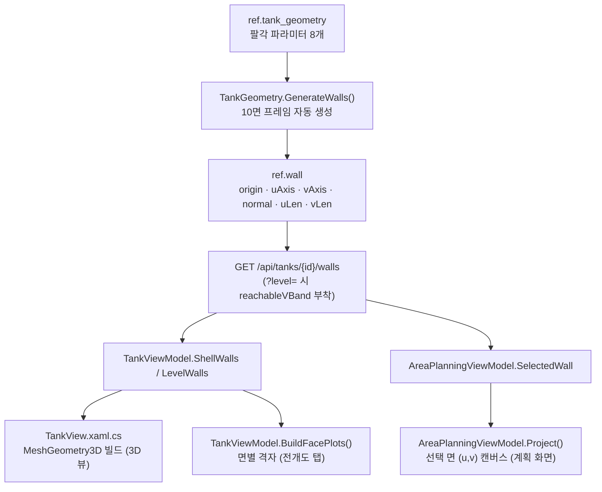

# 선창 도면 렌더링 방법 (3D 뷰 · 전개도)

> 작성 2026-08-27 · 기준 커밋의 `HD.Acs.UI` / `HD.Acs.Core` 코드에서 역으로 정리한 문서.
> **무엇을 그리는가**(기하 모델)는 `SPEC_AREA_TASK_MANUAL.md` §1~§3, **어떤 이름으로 부르는가**는
> `TANK_WALL_LAYOUT.md` §2 와 `surface_id_enum.docx`(대외 정본)가 정본이다.
> 이 문서는 **어떻게 화면에 그리는가**만 다룬다.

---

## 1. 파이프라인 한눈에



핵심은 **면(Wall) 하나가 유일한 진실**이라는 점이다. 3D도 전개도도 계획 화면도 전부
같은 `WallDto`(원점 + U축 + V축 + 크기)를 소비한다. 뷰마다 좌표를 따로 계산하지 않는다.

---

## 2. 좌표계 3단

| 단계 | 프레임 | 단위 | 변환 |
|---|---|---|---|
| ① | **도면 3D** — 원점=바닥 중심, x=길이(+x 선수), y=폭(+y 좌현), z=상방, 바닥 z=0 | m | — |
| ② | **면-로컬 (u,v)** — 면마다 `P0 + u·U + v·V` | m | `WallPose.LocalToDrawing(u,v)` (`Core/Geometry/Vec3.cs`) |
| ③ | **캔버스 px** — 2D 뷰 전용 | px | 뷰별 auto-fit (§6) |

- ②→① 은 `Core`의 순수 함수 하나뿐이다. UI는 이 식을 **직접 인라인해서** 쓴다
  (`TankView.TryPoint` / `TryCorners`, `TankViewModel.Proj`, `AreaPlanningViewModel.Proj`).
  같은 식이 네 군데에 복제되어 있으니, 변환 규약을 바꾸면 네 곳을 모두 고쳐야 한다.
- ③은 **v를 뒤집는다**. 화면은 y가 아래로 증가하고 면-로컬 v는 위로 증가하므로
  `y = margin + (vLen − v)·scale` 형태가 공통이다.
- **맵 좌표(AMR)는 이 3단에 들어오지 않는다.** 도면↔맵 변환(T_W_D)은 릴리즈 경로에만 적용되고
  렌더링 경로에는 없다 (§5.6 참조 — 현재 결함).

---

## 3. 면 생성 — `TankGeometry.GenerateWalls()`

`Core/Planning/TankGeometry.cs`. 파라미터 8개에서 10면을 만든다. 각 면은
**단위벡터 U·V·N + 크기**로만 정의되고, 면 사이 모서리 정합은 생성식이 보장한다.

유도값: `wLow = hLow/tanθ_low`, `B = wFloor + 2·wLow`, `wUp = hUp/tanθ_up`,
`WCeil = B − 2·wUp`, `H = hLow + hWall + hUp`.

| code | 면 | P0 (원점) | U | V | N (내부향) | uLen × vLen |
|---|---|---|---|---|---|---|
| `B`  | 바닥 | (−L/2, −Wf/2, 0) | +x | +y | (0,0,+1) | L × Wf |
| `SL` | 하부 챔퍼 우현 | (−L/2, −Wf/2, 0) | +x | (0,−cosθl,+sinθl) | (0,+sinθl,+cosθl) | L × hLow/sinθl |
| `PL` | 하부 챔퍼 좌현 | (−L/2, +Wf/2, 0) | +x | (0,+cosθl,+sinθl) | (0,−sinθl,+cosθl) | L × hLow/sinθl |
| `SM` | 수직벽 우현 | (−L/2, −B/2, hLow) | +x | +z | (0,+1,0) | L × hWall |
| `PM` | 수직벽 좌현 | (−L/2, +B/2, hLow) | +x | +z | (0,−1,0) | L × hWall |
| `SU` | 상부 챔퍼 우현 | (−L/2, −B/2, hLow+hWall) | +x | (0,+cosθu,+sinθu) | (0,+sinθu,−cosθu) | L × hUp/sinθu |
| `PU` | 상부 챔퍼 좌현 | (−L/2, +B/2, hLow+hWall) | +x | (0,−cosθu,+sinθu) | (0,−sinθu,−cosθu) | L × hUp/sinθu |
| `T`  | 천장 | (−L/2, −Wc/2, H) | +x | +y | (0,0,−1) | L × WCeil |
| `F`  | 선수 격벽 (x=+L/2) | (+L/2, +B/2, 0) | −y | +z | (−1,0,0) | B × H |
| `A`  | 선미 격벽 (x=−L/2) | (−L/2, −B/2, 0) | +y | +z | (+1,0,0) | B × H |

- `origin_offset (ox, oy)`는 P0의 x·y에만 더해진다.
- `facing_yaw = atan2(−N.y, −N.x)` — 법선의 수평 성분이 0인 `B`·`T`는 `null`.
- **격벽 2면은 데이터상 직사각형(B × H)이다.** 실제 윤곽은 팔각이지만 `ref.wall`에는 팔각이
  저장되지 않고, 렌더링 단계에서 파라미터로 다시 그린다 (§5.2 / §6.1).

---

## 4. 왜 격벽만 특별 취급인가

면 8개는 평면 사각형이라 4코너만 알면 그려진다. 격벽 `F`·`A`는 윤곽이 팔각인데
`WallDto`는 그 정보를 갖고 있지 않다. 그래서 렌더러가 **선창 파라미터(`TankGeometryDto`)를 별도로 받아
반폭 함수로 윤곽을 재구성**한다. 같은 계산이 세 군데에 있다.

| 위치 | 함수 | 좌표 | 용도 |
|---|---|---|---|
| `TankView.xaml.cs` | `HalfWidth(g, z)` | 도면 3D (z 기준) | 3D 팔각 메시 |
| `TankViewModel` | `FaceOutlineUv(w)` | 면-로컬 (u,v) | 전개도 탭 윤곽 |
| `AreaPlanningViewModel` | `HalfWidthU(v)` | 면-로컬 (u,v) | 계획 캔버스 윤곽 + 밴드 클리핑 |

세 구현은 같은 구간별 선형식이다. 하부 챔퍼는 `Wf/2 → B/2` 선형, 수직벽은 `B/2` 일정,
상부 챔퍼는 `B/2 → WCeil/2` 선형. 지오메트리가 로드되지 않았으면 셋 다 **직사각형으로 폴백**한다.

> 하나를 고치면 나머지 둘도 같이 고쳐야 한다. 이 중복이 팔각 형상 관련 버그의 주 원인이다.

---

## 5. 3D 뷰 — `Views/TankView.xaml.cs`

HelixToolkit.Wpf. 메시는 XAML이 아니라 **코드비하인드에서 빌드**한다
(`MeshBuilder`가 3.1.2에 없어 `MeshGeometry3D`를 직접 만든다).

진입점은 `Rebuild()` → `BuildShell()` + `BuildLevelHighlight()` + `BuildOverlays()`.
`TankViewModel.ViewChanged` 이벤트 한 개가 이 셋을 모두 다시 트리거한다.

### 5.1 셸

- 면마다 `TryCorners(w, 0,0, uLen,vLen)` 로 4코너 → `Quad()` → 삼각형 2개 + 면 법선 1개.
- `BackMaterial`을 같이 지정한다. 안 하면 화물창 **내부에서 볼 때 면이 사라진다**.
- 모서리는 전 면 공통 `LinesVisual3D` 하나에 점쌍으로 누적한다.
- 빌드 끝에 `Viewport.ZoomExtents()`.

### 5.2 격벽 팔각 (`BulkheadPolygon`)

`F`/`A`이고 지오메트리가 로드되었을 때만 동작하고, 아니면 `null`을 반환해 호출부가 사각형으로 폴백한다.

면 프레임을 쓰지 않고 **도면 좌표에서 직접** 만든다 — `x`는 면 원점의 x를 그대로 쓰고,
z를 `[zLo, zHi]`로 클리핑한 뒤 챔퍼 무릎(`hLow`, `hLow+hWall`)이 구간 안에 있으면 정점으로 추가한다.
그 z 목록에 대해 우현(+y) 아래→위, 좌현(−y) 위→아래 순으로 점을 쌓아 닫힌 다각형을 만든다.

→ `PolygonMesh()` 가 **삼각형 팬**으로 메시화한다. 팔각은 볼록이라 팬으로 충분하지만,
윤곽이 오목해지는 형상이 생기면 이 함수부터 깨진다.

### 5.3 층 z-밴드 강조 (`BuildLevelHighlight`)

- `GET /walls?level=n` 응답의 `reachableVBand = [vLo, vHi]`를 그대로 쓴다 (UI는 밴드를 계산하지 않는다).
- 재질이 `DiffuseMaterial` + `EmissiveMaterial` **두 겹**이다. 발광을 얹은 이유는
  조명·블렌드 순서와 무관하게 또렷하게 보이도록 하기 위함이다.
- **격리 모드(L1~L4 선택)에서는 셸의 반투명 채움을 아예 생략한다.** WPF 3D는 반투명 면도 깊이 버퍼를
  기록해서, 앞쪽 반투명 면(천장 등)이 뒤의 강조 밴드를 깊이 컬링해 버린다. 알파 정렬로 푸는 대신
  **가림 원인을 렌더링에서 제거하는 방식**을 택했다.

### 5.4 영역·작업 오버레이 (`BuildOverlays`)

- 영역은 `Corners`(임의 4점) 우선, 없으면 bbox 사각형 폴백 → `PolygonMesh` + 외곽선 + `BillboardTextVisual3D` 이름표.
- 작업은 용접선 선분(주황) + 시작(녹)·끝(빨) `PointsVisual3D` + seq 라벨.
- 뷰 모드가 `L{n}`이면 `Area.Level == n` 인 것만 그린다. "전체"면 전부.

### 5.5 깊이 충돌(z-fighting) 규칙

같은 평면에 여러 겹을 그리므로 **법선 방향 오프셋**으로 띄운다. 상수는 `HighlightOffsetM = 0.02` (2 cm).

| 레이어 | 오프셋 | 방향 |
|---|---|---|
| 셸 | 0 | — |
| 층 밴드 강조 | 0.02 m | 외부향 (`−normal`) |
| 영역·작업 오버레이 | 0.03 m (`×1.5`) | 외부향 |

법선이 **내부향**이므로 부호를 뒤집어야 바깥으로 나간다. 새 레이어를 추가한다면 0.03 m보다 더 띄울 것.

### 5.6 로봇 마커 — ⚠ 미완성

```csharp
// 로봇 월드 좌표를 3D 씬 좌표에 직접 매핑(placeholder). 실제 좌표 캘리브레이션은 후속.
RobotMarker.Transform = new TranslateTransform3D(x, y, 0);
```

`RobotStateDto.ReportedX/Y`는 **AMR 맵 좌표**인데 도면 좌표 씬에 그대로 찍고 있다.
두 프레임이 우연히 일치하지 않는 한 마커 위치는 틀린다. **T_W_D 역변환(`DrawingTransform`)이 빠져 있다.**
z도 0 고정이라 층이 반영되지 않는다(층은 마커를 흐리게 하는 데만 쓰인다 — `RobotOnSelectedFloor`).

---

## 6. 전개도

전개도는 **두 개**가 있고, 서로 다른 코드로 그린다.

### 6.1 운영 화면 전개도 탭 — `TankViewModel.BuildFacePlots()`

- 면 하나 = 셀 하나. `WrapPanel`에 격자로 나열한다.
- 셀 크기 `240 × 150 px`, 여백 `14 px`. 면마다 독립 auto-fit:
  `scale = min((240−28)/uLen, (150−28)/vLen)`.
- 따라서 **셀 간 축척이 다르다.** 바닥(L × Wf)과 수직벽(L × hWall)이 화면상 비슷한 크기로 보이지만
  실제 치수는 다르다. 헤더에 `"uLen × vLen m"` 을 함께 표시하는 이유가 이것이다.
- 윤곽은 `FaceOutlineUv()` — 격벽은 팔각 8정점, 나머지는 사각형 4정점.
- 층 필터와 무관하게 **전 면·전 층을 항상 표시**한다 (3D 뷰의 층 선택과 연동되지 않는다).

### 6.2 계획 화면 (u,v) 캔버스 — `AreaPlanningViewModel.Project()`

선택한 면 **하나**를 600×600 정사각 캔버스에 그린다. 여백 28 px, 등방 auto-fit.

레이어 순서 (`AreaLayoutView.xaml`의 z-order 그대로):

1. 캔버스 배경
2. **면 전체 윤곽** — 회색 음영 (`FaceOutline`)
3. **선택 층 활성 밴드** — 연녹색 (`ActiveBand`)
4. 타 층 영역 — 회색 (`InactiveAreaBoxes`)
5. 선택 층 영역 — 녹색 + 이름표 (`AreaBoxes`), 정차 마커 = centroid
6. 입력 중 영역 — 파란 점선 (`DraftAreas`)
7. 작업 용접선 · 입력 중 용접선

`Project()`는 좌표 입력 프로퍼티(C1U~C4V, StartU~EndV, AreaName) **전부에 변경 훅**이 걸려 있어
타이핑할 때마다 다시 그린다.

### 6.3 층-로컬 v 규약 — `VOff` / `SliceH`

계획 화면의 **입력값 v는 면 전체 기준이 아니라 선택 층 기준**이다.

```
VOff   = SelectedWall.ReachableVBand[0]        // 그 층 도달 구간의 하한
SliceH = ReachableVBand[1] − ReachableVBand[0]
```

- 운영자는 `v ∈ [0, SliceH]` 로 입력한다. (0,0) = 그 층 도달 구간 좌하단.
- **API 경계에서만** 변환한다 — 저장 시 `+VOff`, 조회 시 `−VOff`. DB에는 항상 면-전체 v가 들어간다.
- 그리기는 면 전체 좌표로 하므로 `Project()` 안에서 다시 `+off` 한다.
- 바닥 `B`·천장 `T`, 격벽 중간층은 `VOff = 0`이라 변환이 티나지 않는다. **버그는 챔퍼와
  격벽 상·하단에서만 드러난다.**

### 6.4 역투영 (캔버스 클릭)

`Project()`가 `_projScale`·`_projVlen`을 남겨두고, `CanvasClick(px,py)`이 그걸로 되돌린다.

```
u = (px − Margin) / _projScale
v = _projVlen − (py − Margin) / _projScale − VOff     // 층-로컬로 환원
```

`PickMode`가 꺼져 있으면 무시한다(오조작 방지). 값은 `[0, uLen]` / `[0, SliceH]`로 clamp.
줌·스크롤은 `AreaLayoutView.xaml.cs`가 `LayoutTransform`으로 처리하고, 클릭 좌표는
**스케일 전 캔버스 좌표(0~600)** 로 받으므로 줌 배율이 역투영에 섞이지 않는다.

---

## 7. 코드 지도

| 파일 | 역할 |
|---|---|
| `Core/Planning/TankGeometry.cs` | 파라미터 → 10면 프레임 생성, 유도값·검증 |
| `Core/Geometry/Vec3.cs` | `Vec3` 벡터 연산, `WallPose.LocalToDrawing` — (u,v)→도면 3D 정본 |
| `Core/Planning/LevelBands.cs` | 층 도달 밴드 계산, `ReachableVBand` (UI가 소비만 함) |
| `UI/Views/TankView.xaml.cs` | 3D 셸·격벽 팔각·층 강조·오버레이 메시 빌드 |
| `UI/ViewModels/TankViewModel.cs` | 셸 데이터 로드, `BuildFacePlots()` 전개도 탭 |
| `UI/ViewModels/AreaPlanningViewModel.cs` | 계획 캔버스 `Project()`, 층-로컬 v 변환, 역투영 |
| `UI/Views/AreaLayoutView.xaml(.cs)` | 계획 캔버스 레이어 z-order, 줌·팬·픽 모드 |
| `UI/Services/TankLayout.cs` | 벽면 코드·층 정적 목록 (전개도 좌표는 **미사용** — §8) |

---

## 8. 문서와 구현이 어긋나 있는 지점

작성 시점에 확인된 3건. 전부 **화면상으로는 정상으로 보이는** 종류라 별도로 기록해 둔다.

### 8.1 전개도 배치가 문서와 다르다

`TANK_WALL_LAYOUT.md` §1·§3과 ADR-005는 **후방 격벽 A를 중심에 둔 방사형 배치**를 표준 레이아웃으로
규정한다. `TankLayout.WallCode` 레코드에 그 좌표(`NormX`/`NormY`)도 들어 있다.

그러나 실제 구현은 `WrapPanel` 격자다. `NormX`/`NormY`는 **어디에도 바인딩되어 있지 않다(사문화)**.
문서를 현행에 맞추든지, 방사형 배치를 구현하든지 한쪽으로 정리가 필요하다.

### 8.2 로봇 마커에 T_W_D 역변환이 없다

§5.6 참조. 코드에 `placeholder` 주석으로 남아 있다.

### 8.3 `A`(후벽) 면의 U축 방향이 대외 정본과 반대다

| 출처 | `F`(전벽) U축 | `A`(후벽) U축 |
|---|---|---|
| `surface_id_enum.docx` (대외 정본) · 비전 인터페이스 v3 §5 · 세이지 회신 | 좌현 → 우현 | **좌현 → 우현** |
| `TankGeometry.GenerateWalls()` | 좌현 → 우현 (U = −y) ✅ | **우현 → 좌현 (U = +y)** ❌ |

코드는 SPEC §1의 "마구리 면은 선창 내부에서 봤을 때 왼→오른쪽" 규칙을 따르고 있어 **내부적으로는 일관**하다.
문제는 그 규칙이 두 격벽에서 서로 반대 방향을 가리키는데, 대외 정본은 둘 다 "좌현 → 우현"으로 적었다는 점이다.

**영향**: 후벽에서 촬영한 이미지의 u 좌표가 세이지 쪽에서 좌우 반전된 위치로 해석된다.
u 값이 유효 범위 안이라 어떤 검증에도 걸리지 않는다.

**어느 쪽이 맞는지는 확정되지 않았다.** 코드를 고칠지 정본을 고칠지 결정이 필요하며,
정본은 이미 세이지·비전 측에 공유되었으므로 개정 시 3자 동시 반영이 필요하다.

---

## 9. 손댈 때 지켜야 할 것

1. **(u,v)→도면 3D 식은 `WallPose.LocalToDrawing` 하나가 정본이다.** UI에 복제된 네 곳
   (§2)은 그 사본일 뿐이다. 규약을 바꾸면 네 곳을 함께 고치고, 인접 면 공유 모서리 일치 테스트로 확인한다.
2. **격벽 반폭 함수 3중복**(§4)을 인지하고 셋을 같이 고친다.
3. **새 3D 레이어는 법선 오프셋을 0.03 m보다 크게** 준다(§5.5). 법선은 내부향이므로 부호를 뒤집는다.
4. **반투명 면을 추가할 때는 깊이 컬링을 먼저 의심**한다(§5.3). 알파 정렬보다 가림 원인 제거가 이 코드의 방침이다.
5. **계획 화면에서 v를 만질 때는 그 값이 층-로컬인지 면-전체인지 먼저 확인**한다(§6.3).
   API 경계 밖에서 `±VOff`를 하면 조용히 어긋난다.
6. **전개도 셀은 면마다 축척이 다르다**(§6.1). 셀 간 크기를 비교 근거로 쓰지 않는다.

---

## 관련 문서

- `SPEC_AREA_TASK_MANUAL.md` — 좌표계 규약(§1), 선창 파라메트릭 정의(§2), 면 자동 생성(§3), UI 요구(§9)
- `TANK_WALL_LAYOUT.md` — 전개도 구성(§1), 벽면 코드 naming rule(§2), 층 구조(§4)
- `surface_id_enum.docx` — Surface ID / Surface Type 대외 정본
- `ARCHITECTURE_DECISIONS.md` — ADR-005(UI·API 계층), ADR-012(좌표 프레임)
