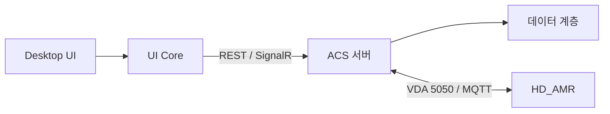

# 시스템 구조

| 저장소 프로젝트 | 역할 |
|---|---|
| HD.Acs.UI.Desktop | Avalonia 데스크톱 UI, 뷰와 플랫폼 어댑터 |
| HD.Acs.UI.Core | 공용 ViewModel, DTO, API 클라이언트, 렌더링 로직 |
| HD.Acs.App | ACS 서버 애플리케이션 |
| HD.Acs.Core | 핵심 도메인·계획·기하 로직 |
| HD.Acs.Data | 데이터 접근 계층 |
| HD.Acs.Vda5050 | VDA 5050 통신 계층 |
| HD.Acs.Simulator / HD.Acs.SimTest | 시뮬레이터와 시나리오 검증 프로젝트 |

Desktop 프로젝트는 `net8.0`, Avalonia 주요 패키지 `11.3.20`을 사용합니다. UI Core를 참조하며 ViewModel의 영역 등록은 API 클라이언트로 이어집니다.

이 구조도는 구성 관계를 요약하며 실제 서버 실행 여부를 뜻하지 않습니다.

관련: [[HD_ACS - Desktop UI]] · [[HD_ACS - AMR 인터페이스]] · [[HD_ACS - 근거 목록]]
